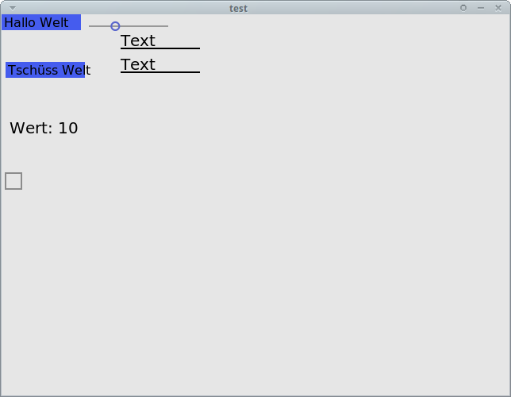

# GUI for Rust

Little an simple gui library for [Rust](http://www.rust-lang.org/) inspired by react.
gui and uses [nanovg](https://github.com/enex/nanovg-rs) as default backend library for rendering.

Everything should be abstracted into the widget api including all drawing-operations.
This allows to switch the backend without changing the api. Aditionaly it simplifyes
the usage of the api because there are only some widgets you should know about and
not more.

## build
it should normaly compile with `cargo build` if not follow the instructions for
[nanovg](https://github.com/enex/nanovg-rs) which could be the reason why failed.

## Ideas
**random thoughts not jet implemented**

### animation
idea with animation
```rust
let animated = Animation::new(component, |c, x|{
	c.x = x;
	c.y = y;
}, Linear);

c.add(1, animated);
```
this means to just use a wrapper component which takes the component which
should be animated and manages the state of the animation. on every tick
event it calls the clusure modifying the component with the current paramer.

### styling
The context handles the style if a element is not styled the values returned
from style are the default values. If there is something specified, this style
will be applied to the component if not overridden. This way each component
can be easily styled. Later in the process I might develop a small css like
style language to make styling applications as easy as styling html.

```rust
let b = Button{
	..c.style("agree")
};
c.add(1, b);
```

### Macros
**this is not jet implemented and might change**

| pattern               | description                          |
|-----------------------|--------------------------------------|
| `[...]`               | container for child nodes            |
| `{...}`               | indicates some code for this context |
| `|$event:ident|{...}` | some event handling code             |
| `$name:ident(...)`    | a new widget                         |

```rust
data!(
	Group[
		Path("M12,54L4,4L34,100"),
		Button(text="Hallo")|event|{
			//handle the events here
			//
		}//==Button("Hallo")
	]
);
widget! Button(
	(
		text: &str = "",
		icon: Option<Icon> = None,
	){
		Path(...)
	}
);
```

```qml
Button{
	x: 10
	y: 100
	text: "test"

	Name{
		x: 100
		y: 10
		text: "wer auch immer"
	}
}
```

## TODO:
 - [ ] make component system work
 - [ ] [build some basic components](./src/components)
   - [x] [Icon](./src/components/icon.rs)
   - [x] [Button](./src/components/button.rs) 
   - [ ] [Checkbox](./src/components/checkbox.rs)
   - [ ] [Image](./src/components/image.rs)
   - [x] [Label](./src/components/label.rs)
   - [ ] [LineEdit](./src/components/text_input.rs)
   - [ ] NumberInput
   - [ ] MultilineEdit
   - [ ] [Dropdown](./src/components/dropdown.rs)
   - [ ] [Tabs](./src/components/tabs.rs)
   - [ ] List
   - [ ] BoxLayout
 - [ ] [layout](./src/components/layout.rs)
 - [ ] create macros for easier interaction
 - [ ] animation
 - [ ] caching
 - [ ] state management
 - [ ] theming

## Screenshots



## Links
 - https://github.com/reem/rust-typemap
 - https://github.com/TomBebbington/glutin
 - https://github.com/uil-lang/uil-rs
